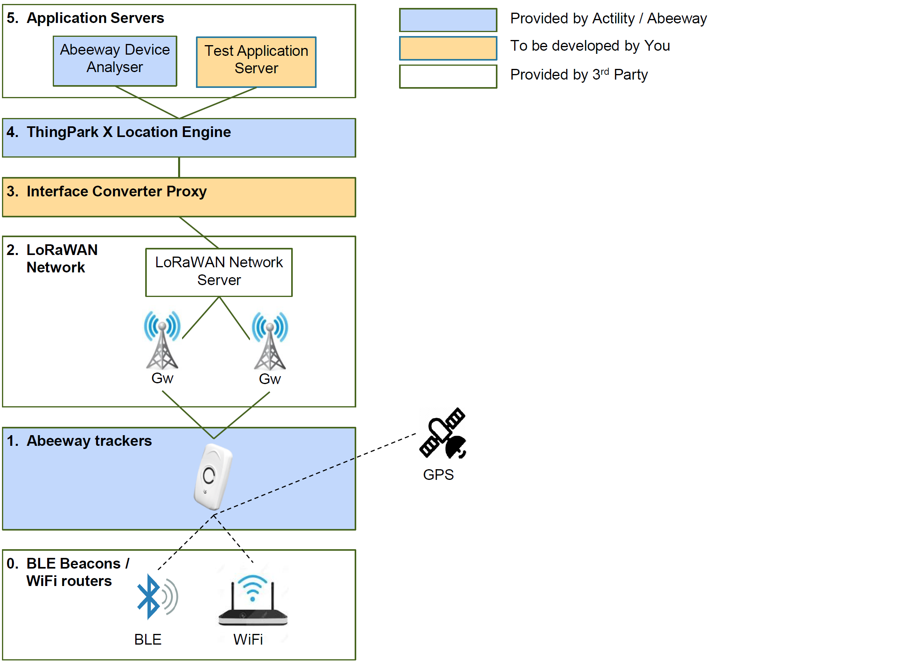

# Integrating Abeeway devices and ThingPark X Location Engine with any 3rd party LoRaWAN Network Server
## Introduction
This document explains how to set up a lab environment for testing the unique features of [Abeeway][abeeway] tracker devices with different types of LoRaWAN Network Servers. The lab environment requires the following components:

0. **BLE beacons / WiFi routers**  
   _These components are required only in case you want to test the BLE/WiFi scan feature of the trackers_
1. **[Abeeway][abeeway] trackers**
2. **A [LoRaWAN][lorawan] Network**  
   _A network is built from LoRaWAN Gateways and a LoRaWAN Network Server. In this tutorial we assume that the network is already present and offers reliable connectivity at the test area._  
3. **An interface converter application**  
   _It is a proxy application that translates messages between the LoRaWAN Network Server and the Location Solver. We will explain how you can develop your own interface proxy utilizing our [Node-RED][node-red] examples. (Please note that this component is not needed if you are using Actility Thingpark in the cloud.)_
4. **[ThingPark X Location Engine][actility-tpl] (TPXLE)**  
   _TPXLE is Actility's Location Solver in the cloud_
5. **Application Servers**  
   _Application servers will visualize the location data reported by trackers. In our demo environment we will use 2 application servers:_   
   * **The Abeeway Device Analiser (ADA)**  
     _ADA is a demo application server provided by Actility in the cloud to test and configure Abeeway trackers_
   * **A test application server**  
     _We will explain how to build your own application server based on [Node-RED][node-red]_

These components are also presented on Figure 1 below. Blue color represents components from Actility and Abeeway, orange color represents componets that we plan to develop ourselves and white components are from 3rd parties.

_Figure 1. - The components of the planned test environment_

We will explain and present example code on how to integrate the above-listed components with the following network servers:
 * [Actility][actility] [ThingPark Wireless][actility-tpw] or [ThingPark Enterprise][actility-tpe]  
   _This integration is only needed in case of On-Customer-Premise (OCP) deployments. SaaS platforms already have te necessary interfaces._
 * [The Things Network][ttn] (TTN)
 * [Loriot][loriot]
 * [Senet](https://www.senetco.com/)
 * [Multitech][multitech-lns]
 * [Kerlink][kerlink] [Wanesy][kerlink-wanesy]
 
## The main steps to set up the lab
The main steps to set up the lab enviroment are the following:
1. Set up a LoRaWAN network that offers reliable LoRaWAN connectivity for yaour Abeeway trackers
2. Set up a node-RED application server and make it available through the Internet
3. Provision your trackers on the LoRaWAN network server and set up message routing to your node-RED application server 
4. Turn on your trackers and check if their messages arrive at the node-RED app server

[lorawan]: https://lora-alliance.org/about-lorawan
[abeeway]: https://www.abeeway.com/
[actility]: https://www.actility.com/
[actility-tpw]: https://www.actility.com/public-iot-connectivity-solutions/
[actility-tpe]: https://www.actility.com/enterprise-iot-connectivity-solutions/
[actility-tpl]: https://www.actility.com/multi-technology-geolocation-solutions/
[ttn]: https://www.thethingsnetwork.org/
[loriot]: https://www.loriot.io/
[multitech]: https://www.multitech.net/ 
[multitech-lns]: https://www.multitech.net/developer/software/lora/lora-network-server/
[kerlink]: https://www.kerlink.com 
[kerlink-wanesy]: https://www.kerlink.com/iot-portfolio-and-technologies/connectivity-as-a-service/wanesy-naas/
[node-red]: https://nodered.org/
